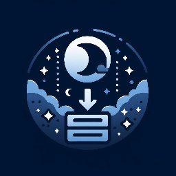
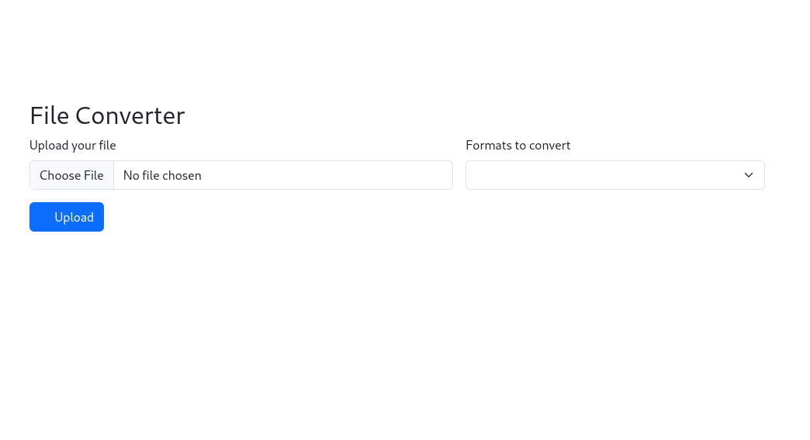
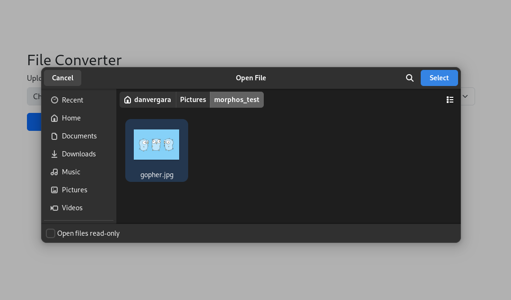
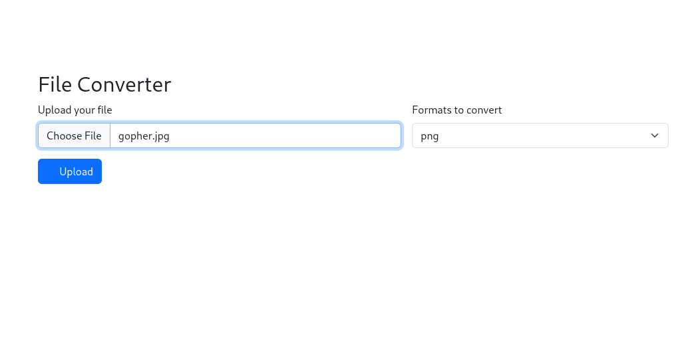
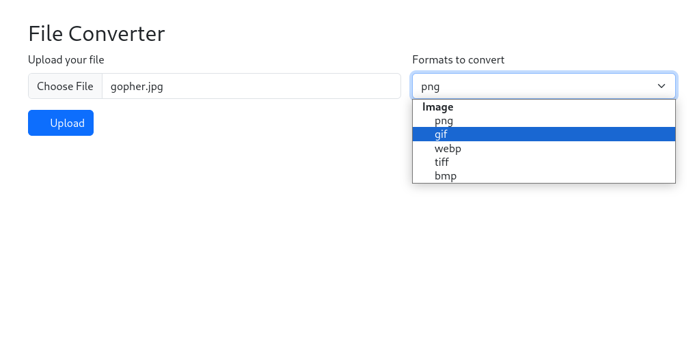
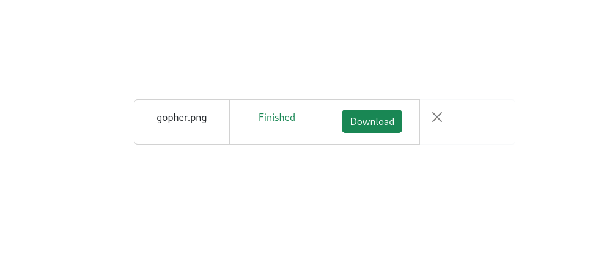
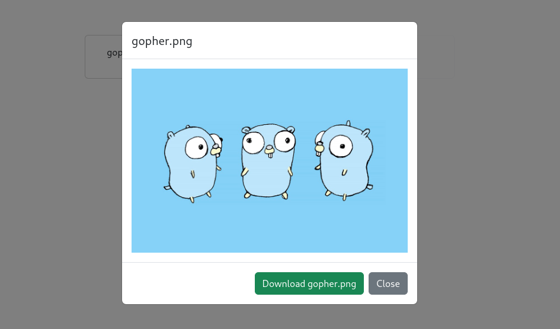

Morphos Server
===============


[](https://github.com/danvergara/morphos/releases)

<p align="center">
  
</p>

__Self-Hosted file converter server.__

## Table of contents

- [Overview](#overview)
- [Installation](#installation)
    - [Docker](#docker)
- [Features](#features)
- [Usage](#usage)
- [Supported Files](#supported-files-and-convert-matrix)
    - [Images To Images](#images-x-images)
    - [Images To Documents](#images-x-documents)
    - [Documents To Images](#documents-x-images)
- [License](#license)

## Overview

Today we are forced to rely on third party services to convert files to other formats. This is a serious threat to our privacy, if we use such services to convert files with highly sensitive personal data. It can be used against us, sooner or later.
Morphos server aims to solve the problem mentioned above, by providing a self-hosted server to convert files privately. The project provides an user-friendly web UI.
For now, Morphos only supports images. Documents will be added soon.

## Installation

### Docker

```
docker run --rm -p 8080:8080 -v /tmp:/tmp ghcr.io/danvergara/morphos-server:latest
```

## Features

- Serves a nice web UI
- Simple installation (distributed as a Docker image)

## Usage

Run the server as mentioned above and open up your favorite browser. You'll see something like this:



Hit the file input section on the form to upload an image.



You'll see the filed uploaded in the form.



Then, you can select from a variety of other formats you can convert the current image to.



After hitting `Upload` button you will see a view like the one below, asking you to download the converted file.



A modal will pop up with a preview of the converted image.



## Supported Files And Convert Matrix

### Images X Images

|       |  PNG  |  JPEG  |  GIF  |  WEBP  |  TIFF  |  BMP  |  AVIF  |
|-------|-------|--------|-------|--------|--------|-------|--------|  
|  PNG  |       |   ✅   |  ✅   |   ✅   |   ✅   |  ✅   |   ✅   |
|  JPEG |  ✅   |        |  ✅   |   ✅   |   ✅   |  ✅   |   ✅   |  
|  GIF  |  ✅   |   ✅   |       |   ✅   |   ✅   |  ✅   |   ✅   | 
|  WEBP |  ✅   |   ✅   |  ✅   |        |   ✅   |  ✅   |   ✅   |
|  TIFF |  ✅   |   ✅   |  ✅   |   ✅   |        |  ✅   |   ✅   |
|  BMP  |  ✅   |   ✅   |  ✅   |   ✅   |   ✅   |       |   ✅   |
|  AVIF |  ✅   |   ✅   |  ✅   |   ✅   |   ✅   |  ✅   |        |

### Images X Documents

|       |  PDF  |
|-------|-------|
|  PNG  |  ✅   |
|  JPEG |  ✅   |
|  GIF  |  ✅   |
|  WEBP |  ✅   |
|  TIFF |  ✅   |
|  BMP  |  ✅   |
|  AVIF |       |

## Documents X Images

|     | PNG | JPEG | GIF | WEBP | TIFF | BMP |  AVIF | 
| --- | --- | ---- | --- | ---- | ---- | --- | ----  |
| PDF | ✅  | ✅   | ✅  | ✅   | ✅   | ✅  |       |

## Documents X Documents

|      | DOCX | PDF | XLSX | CSV |
| ---- | ---- | --- | ---- | --- |
| PDF  | ✅   |     |      |     |
| DOCX |      | ✅  |      |     |
| CSV  |      |     |  ✅  |     |
| XLSX |      |     |      | ✅  |

## Ebooks X Ebooks

|      | MOBI | EPUB |
| ---- | ---- | --- |
| EPUB | ✅   |     |
| MOBI |      | ✅  |


## Documents X Ebooks

|      | EPUB | MOBI |
| ---- | ---- | ---  |
| PDF  | ✅   | ✅   |
| DOCX |      |      |
| CSV  |      |      |
| XLSX |      |      |

## Ebooks X Documents

|      | PDF  |
| ---- | ---- |
| EPUB |  ✅  |
| MOBI |  ✅  |

## License
The MIT License (MIT). See [LICENSE](LICENSE) file for more details.
